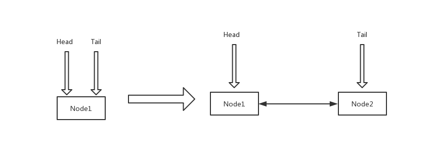

# AQS源码解析.

## 引言
* 提到JAVA加锁，我们通常会想到synchronized关键字或者是Java Concurrent Util（简称JCU）包下面的ReentrantLock（简称lock），线程池实现类也依赖lock实现线程同步。
* 除此之外我们还能想到的具有实用场景的线程工具类，比如说 如何让某些线程等待某个事件发生后开始执行（CountDownLatch），又比如说如何让这些线程都准备就绪后一起开始执行（CyclicBarrier）。这些场景都有现成的工具类可以使用，不需要我们再去实现
* 今天的源码分享围绕AQS，通过它的实现类为例进行分析。目的是希望在坐的同学都能掌握和熟悉AQS，能熟练运用他的直接或间接实现类。甚至可以自己写一个AQS的实现类

## AQS是啥？
* AQS（AbstractQueuedSynchronizer）是JDK1.5提供的一个基于FIFO等待队列实现的一个用于实现同步器的基础框架，这个基础框架的重要性可以这么说，JCU包里面几乎所有的有关锁、多线程并发以及线程同步器等重要组件的实现都是基于AQS这个框架。AQS的核心思想是提供给子类一个volatile int state这样的一个属性，由子类通过CAS操作控制这个属性。最终通过这个属性告诉AQS是否需要挂起当前线程。然后，被挂起的线程如何取消挂起，有几个线程没有被挂起，这里就涉及到AQS的两种模式：独占模式和共享模式。一个AQS的实现类要么实现它的独占模式要么实现它的共享模式。独占模式顾名思义，只有一个线程执行，其他线程都必须等这个线程完成后才能按顺序一个一个执行。共享模式呢,所有线程都得等着，但只要有一个线程获取到锁了，所有线程都会“传播式”的被唤醒
* 关于volatile关键字的作用，稍微提一下。主要有两点 1.volatile可以防止指令重排。指令重排是jvm将java指令翻译成汇编指令时的一种优化手段。假设存在如下所示代码，一个线程运行这段代码时，第一行代码和第二行代码一定在第四行代码之前完成，但是编译器可能在第四行代码完成前先执行了第三行第五行。假设对sum加入了volatile关键字，那么可以保证，第一第二第三行代码一定在第四行代码执行前完成，第五行代码一定在第四行代码完成后开始执行。（以后有空再实践证明，大致时这个意思） 2.volatile另外一个作用是当两个线程操作一个共享变量是，一个线程如果完成对这个变量的赋值，那么对另外一个线程一定是可见的。但是，volatile并不是线程安全的。因为任何一个java指令都不是原子的，都会被拆分为多个汇编指令（机器指令）。绕的有点远，不说了
```java
int i = 2;//第一行
int j = 1;//第二行
int x = 5;//第三行
int sum = i + j; //第四行
int y = 6; //第五行
```

## AQS数据结构
```java
public abstract class AbstractQueuedSynchronizer {

    private transient volatile Node head;

    private transient volatile Node tail;

    private volatile int state;

    class Node {
        //代表当前节点属于共享模式
        static final Node SHARED = new Node();
        //代表当前节点属于独占模式
        static final Node EXCLUSIVE = null;
        /** waitStatus value to indicate thread has cancelled */
        static final int CANCELLED =  1;
        /** waitStatus value to indicate successor's thread needs unparking */
        static final int SIGNAL    = -1;
        /** waitStatus value to indicate thread is waiting on condition */
        static final int CONDITION = -2;
        /**
         * waitStatus value to indicate the next acquireShared should
         * unconditionally propagate
         */
        static final int PROPAGATE = -3;
        /** 当前节点的状态，其值是上面4个状态的一个 */
        volatile int waitStatus;
        /** 当前节点的上一个节点 */
        volatile Node prev;
        /** 当前节点的下一个节点 */
        volatile Node next;
        /** 当前节点持有的线程对象引用 */
        volatile Thread thread;

        Node nextWaiter;

        Node(Thread thread, Node mode) {     // Used by addWaiter
            this.nextWaiter = mode;
            this.thread = thread;
        }

        Node(Thread thread, int waitStatus) { // Used by Condition
            this.waitStatus = waitStatus;
            this.thread = thread;
        }
    }
}
```

* addWaiter方法，是AQS添加节点的方法。不管是独占模式还是共享模式，需要被挂起的线程都会通过这个方法最终保存在Node节点中。
```java
/**
 * 为当前线程创建一个节点，然后加入到队列里同时指定模式（mode）
 *
 * @param mode Node.EXCLUSIVE for exclusive, Node.SHARED for shared
 * @return the new node
 */
private Node addWaiter(Node mode) {
    //创建当前线程的一个节点，并指定模式
    Node node = new Node(Thread.currentThread(), mode);
    Node pred = tail;
    if (pred != null) {
        //如果最后一个节点存在，替换当前节点为最后一个节点
        node.prev = pred;
        if (compareAndSetTail(pred, node)) {
            //将该节点加入到队列中
            pred.next = node;
            return node;
        }
    }
    enq(node);
    return node;
}

private Node enq(final Node node) {
    //具有失败重试机制的节点入队功能
    for (;;) {
        Node t = tail;
        if (t == null) {
            //如果不存在队列，则先创建一个节点
            if (compareAndSetHead(new Node()))
                tail = head;
        } else {
            node.prev = t;
            if (compareAndSetTail(t, node)) {
                t.next = node;
                return t;
            }
        }
    }
}

private final boolean compareAndSetHead(Node update) {
    /** 在this对象所在的内存地址，偏移量为headOffset的位置上。如果原始值为null则替换为update，否则返回false。*/
    return unsafe.compareAndSwapObject(this, headOffset, null, update);
}
```
* node节点初始化图



* 从addWaiter方法中我们可以发现，Head指向的节点是空节点，另一层含义是正在运行的节点。

## 独占模式讲解
* acquireInterruptibly 是AQS独占模式获取锁的入口。当然还有个acquire方法，两者区别在于是否抛出InterruptedException异常，之所以选择acquireInterruptibly是顺便提一下关于interrupt的作用和使用场景，不是今天的主题可以忽略。interrupt实际上是线程的一个状态位，用于多个线程之间的通讯。修改这个状态位是通过native方法，也就是通过操作系统原语来保证线程安全的更新和获取状态位。其目的是为了让被打断线程响应这次打断，当然被打算线程也可以忽略这次打断，都是可以的。
```java
public final void acquireInterruptibly(int arg)
        throws InterruptedException {
    //native方法，判断当前线程是否被打断，如果被打断返回true，并清空打断状态
    if (Thread.interrupted())
        //如果线程被打断则抛出异常
        throw new InterruptedException();
    //尝试获取锁，tryAcquire是提供给子类去实现的
    if (!tryAcquire(arg))
        //实现类没有获取到锁，执行doAcquireInterruptibly方法
        doAcquireInterruptibly(arg);
}

private void doAcquireInterruptibly(int arg)
    throws InterruptedException {
    //添加一个当前线程的Node节点，加入到队列 并设置为独占模式（mode）
    final Node node = addWaiter(Node.EXCLUSIVE);
    boolean failed = true;
    try {
        for (;;) {
            //获取当前节点的前一个节点
            final Node p = node.predecessor();
            //如果前一个节点是head节点，则尝试重新获取锁（tryAcquire）
            if (p == head && tryAcquire(arg)) {
                //获取成功，将当前节点设置为头节点
                setHead(node);
                //将上一个节点的next属性设置为空，帮助gc
                p.next = null; 
                //设置false且跳出死循环
                failed = false;
                return;
            }
            //如果没有获取到锁或者前一个节点不是头节点
            if (shouldParkAfterFailedAcquire(p, node) &&
                parkAndCheckInterrupt())
                //如果线程被打断过 抛出异常
                throw new InterruptedException();
        }
    } finally {
        if (failed)
            cancelAcquire(node);
    }
}

private static boolean shouldParkAfterFailedAcquire(Node pred, Node node) {
    int ws = pred.waitStatus;
    if (ws == Node.SIGNAL)
        return true;
    if (ws > 0) {
        do {
            node.prev = pred = pred.prev;
        } while (pred.waitStatus > 0);
        pred.next = node;
    } else {
        compareAndSetWaitStatus(pred, ws, Node.SIGNAL);
    }
    return false;
}

private final boolean parkAndCheckInterrupt() {
    //挂起当前线程 直到unpark
    LockSupport.park(this);
    //当线程被unpark之后，返回当前线程是否被打断的标志
    return Thread.interrupted();
}
```
* 这样就讲完了获取锁的所有操作，然后是释放锁的操作release
```java
public final boolean release(int arg) {
    //tryRelease子类去控制如何释放锁
    if (tryRelease(arg)) {
        //释放成功
        Node h = head;
        if (h != null && h.waitStatus != 0)
        //head不等于空，调用unparkSuccessor
            unparkSuccessor(h);
        return true;
    }
    return false;
}

private void unparkSuccessor(Node node) {
    //获取当前节点的状态
    int ws = node.waitStatus;
    if (ws < 0)
        //如果当前节点状态小于0，设置为0
        compareAndSetWaitStatus(node, ws, 0);
    //获取当前节点的下一个节点
    Node s = node.next;
    if (s == null || s.waitStatus > 0) {
        //如果下一个节点为空，或者下一个节点已取消，则从队列尾部开始，往前找。找到一个状态小于0的节点
        s = null;
        for (Node t = tail; t != null && t != node; t = t.prev)
            if (t.waitStatus <= 0)
                s = t;
    }
    //最终取消挂起这个节点
    if (s != null)
        LockSupport.unpark(s.thread);
}
```
* DEBUG: ReentrantLock 对于AQS的实现类
```java
/**
 * 非公平锁
 */
static final class NonfairSync extends Sync {

    private static final long serialVersionUID = 7316153563782823691L;

    final void lock() {
        //直接获取锁，如果获取成功，设置锁的拥有着为该线程
        if (compareAndSetState(0, 1))
            setExclusiveOwnerThread(Thread.currentThread());
        else
        //否则去按照规则获取锁
            acquire(1);
    }

    protected final boolean tryAcquire(int acquires) {
        return nonfairTryAcquire(acquires);
    }

    final boolean nonfairTryAcquire(int acquires) {
        final Thread current = Thread.currentThread();
        //获取当前state
        int c = getState();
        if (c == 0) {
            //如果为0，尝试更改state状态
            if (compareAndSetState(0, acquires)) {
                //更改成功设置自己为owner线程
                setExclusiveOwnerThread(current);
                return true;
            }
        }
        else if (current == getExclusiveOwnerThread()) {
            // 可重入支持，如果owner线程为自己 则state往上加
            int nextc = c + acquires;
            if (nextc < 0)
                //溢出时会发生，是不可能。栈深度不可能达到Maximum（2^32-1）
                throw new Error("Maximum lock count exceeded");
            setState(nextc);
            return true;
        }
        return false;
    }
}

/**
 * 公平锁
 */
static final class FairSync extends Sync {
    private static final long serialVersionUID = -3000897897090466540L;

    final void lock() {
        acquire(1);
    }

    protected final boolean tryAcquire(int acquires) {
        final Thread current = Thread.currentThread();
        int c = getState();
        if (c == 0) {
            // 状态是0 且队列为空 ，更新状态
            if (!hasQueuedPredecessors() &&
                compareAndSetState(0, acquires)) {
                //更新成功，则设置owner为当前线程
                setExclusiveOwnerThread(current);
                return true;
            }
        }
        else if (current == getExclusiveOwnerThread()) {
            //可重入支持
            int nextc = c + acquires;
            if (nextc < 0)
                throw new Error("Maximum lock count exceeded");
            setState(nextc);
            return true;
        }
        return false;
    }
}

protected final boolean tryRelease(int releases) {
    int c = getState() - releases;
    if (Thread.currentThread() != getExclusiveOwnerThread())
        throw new IllegalMonitorStateException();
    boolean free = false;
    if (c == 0) {
        free = true;
        setExclusiveOwnerThread(null);
    }
    setState(c);
    return free;
}
```
* ConditionObject。AQS内部类。作用：假设某个线程获取到了锁，但在运行的过程中发现需要等待某个事件发生，但是这个时候如果不释放锁很有可能导致死锁。基于这种场景，出现了这个内部类。

## 共享模式讲解
* acquireShared是获取共享锁的入口
```java
public final void acquireSharedInterruptibly(int arg)
        throws InterruptedException {
    if (Thread.interrupted())
        throw new InterruptedException();
    //尝试获取共享锁
    if (tryAcquireShared(arg) < 0)
        //获取失败，则执行doAcquireShared
        doAcquireSharedInterruptibly(arg);
}

private void doAcquireSharedInterruptibly(int arg)
    throws InterruptedException {
    //添加一个节点，加入队列并设置共享模式（mode）
    final Node node = addWaiter(Node.SHARED);
    boolean failed = true;
    try {
        for (;;) {
            final Node p = node.predecessor();
            if (p == head) {
                int r = tryAcquireShared(arg);
                if (r >= 0) {
                    setHeadAndPropagate(node, r);
                    p.next = null; // help GC
                    failed = false;
                    return;
                }
            }
            if (shouldParkAfterFailedAcquire(p, node) &&
                parkAndCheckInterrupt())
                throw new InterruptedException();
        }
    } finally {
        if (failed)
            cancelAcquire(node);
    }
}

private void setHeadAndPropagate(Node node, int propagate) {
    Node h = head; // Record old head for check below
    setHead(node);
    if (propagate > 0 || h == null || h.waitStatus < 0 ||
        (h = head) == null || h.waitStatus < 0) {
        Node s = node.next;
        if (s == null || s.isShared())
            doReleaseShared();
    }
}

private void doReleaseShared() {
    for (;;) {
        //获取头节点
        Node h = head;
        if (h != null && h != tail) {
            //头节点不为空
            int ws = h.waitStatus;
            if (ws == Node.SIGNAL) {
                //设置节点状态为0
                if (!compareAndSetWaitStatus(h, Node.SIGNAL, 0))
                    //失败重试
                    continue;
                //取消挂起下一个节点
                unparkSuccessor(h);
            }
            //如果节点已经是0了 就设置成-3 然后跳出循环。当然这里也是失败重试的
            else if (ws == 0 &&
                        !compareAndSetWaitStatus(h, 0, Node.PROPAGATE))
                continue;
        }
        if (h == head)                   
            break;
    }
}

```
* DEBUG：CountDownLatch 对于共享锁的实现.
```java
private static final class Sync extends AbstractQueuedSynchronizer {
    private static final long serialVersionUID = 4982264981922014374L;

    Sync(int count) {
        setState(count);
    }

    int getCount() {
        return getState();
    }

    protected int tryAcquireShared(int acquires) {
        //如果state等于0 则返回 1 否则返回 -1
        //也就意味着初始化的时候 state应该是要大于0的
        return (getState() == 0) ? 1 : -1;
    }

    protected boolean tryReleaseShared(int releases) {
        // 当state从1变到0的时候返回true，其他清空均为false
        for (;;) {
            int c = getState();
            if (c == 0)
                return false;
            int nextc = c-1;
            if (compareAndSetState(c, nextc))
                return nextc == 0;
        }
    }
}
```
## 总结
* AQS两种模式下，锁是否可以被获取交给子类自己去实现。
* 对于独占锁，只有头节点获取到了锁其余节点都被挂起，并保存在Node节点中。
* 对于共享锁，只要第一个节点获取到了锁，就继续唤醒这个节点的下一个节点。以实现共享状态的“传播”从而实现共享功能
* 首先，AQS 并不关心“是什么锁”，对于 AQS 来说它只是实现了一系列的用于判断“资源”是否可以访问的 API, 并且封装了在“访问资源”受限时将请求访问的线程的加入队列、挂起、唤醒等操作， AQS 只关心“资源不可以访问时，怎么处理？”、“资源是可以被同时访问，还是在同一时间只能被一个线程访问？”、“如果有线程等不及资源了，怎么从 AQS 的队列中退出？”等一系列围绕资源访问的问题，而至于“资源是否可以被访问？”这个问题则交给 AQS 的子类去实现。
## 一些题外话
* 在AQS刚出来的时候，受到了很多开发者的喜爱。原因在于在1.5版本的jvm环境下，内置锁（synchronized）性能远低于Unsafe工具对线程的操作（原子的挂起线程）。但是在功能实现角度讲，lock能实现的功能用内置锁一样能实现，只是实现的思路会不太一样。因此，在后面版本的jdk中java语言的开发人员对内置锁做了很大的优化，到目前内置锁和lock的性能差距已经很小了，但JCU包下面的很多工具类还是非常实用的，这是内置锁没办法弥补的，因此应用场景还是非常广泛，并且lock对于开发者角度更人性化，简化了开发难度。
* 其实对比JCU包的发展历程，不难发现 JCU 只是个工具包，只是它太好用了，走在了java语言的前面，所以它火了。同样的事情也发生在java的另外一个功能上———java10的模块化，模块化把所有java的内置包都当成是依赖按需加载，为了完成这个功能java语言的开发人员不知道花费了多少精力，但应用并不广泛。它的作用是使java应用程序更轻量，可能原来100M的jar包最后只需要1M就够了，但实际场景我们并不是特别关心jar包大小，更多的关心是性能优化。然而很明显模块化和性能没有半毛钱关心，而且管理依赖早就已经有了非常成熟的体系比如maven等（据说阿里有自己的中间件管理依赖，不是特别了解），总之这样一个呕心沥血的功能需要改变开发者的开发方式，基本是不可能实现的任务，原因是出来的太晚了，没人支持，也没人为此做迭代。
* ok,就到这里
